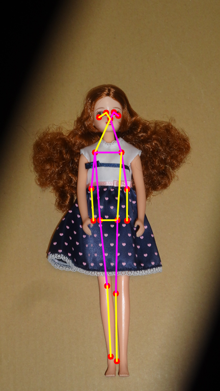
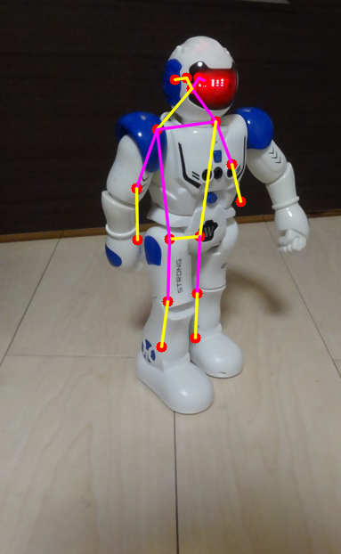
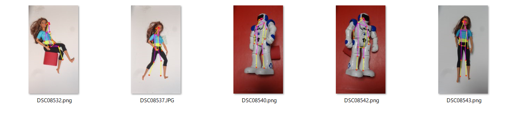
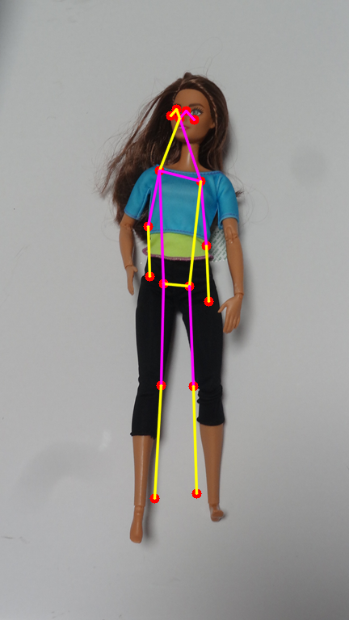
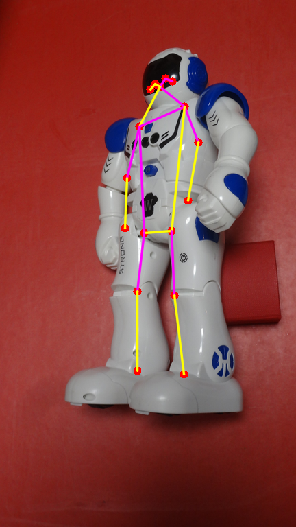
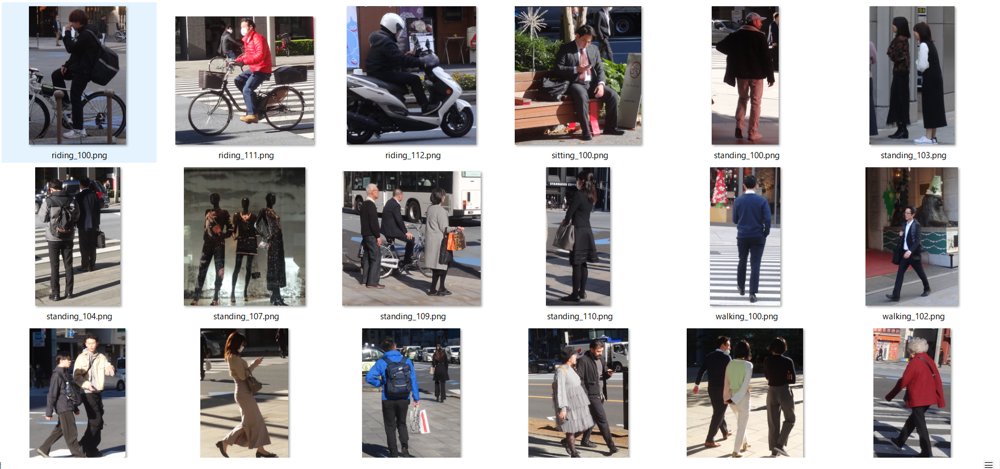
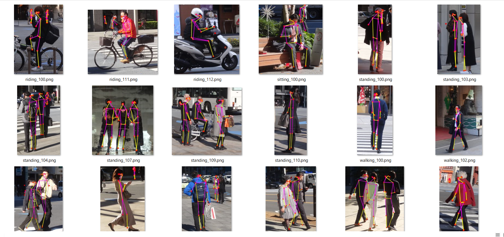
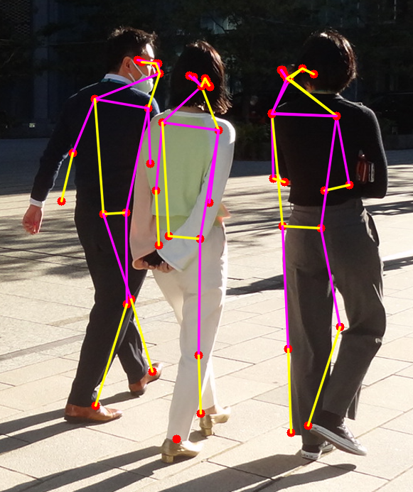

<h2>Tensorflow-MoveNet-HumanPose-Estimator (Updated:2023/12/08)</h2>

<h3>1 Base Source Code </h3>
This is based on the following Tensorflow MoveNet Pose Estimation tutorial. 

 https://github.com/tensorflow/docs/blob/master/site/en/hub/tutorials/movenet.ipynb 
,and kaggle code: 

 https://www.kaggle.com/code/ibrahimserouis99/human-pose-estimation-with-movenet 

Updated:
<li>2023/12/08: Modified the urls of movenet modules to be https://www.kaggle.com/models/google/movenet/frameworks/TensorFlow2/variations/* in <a href="./TensorflowMoveNetHumanPoseEstimator.py"> TensorflowMoveNetHumanPoseEstimator.py</a></li>
<li>2023/12/08: Modified <a href="./HumanPoseVisualizer.py">HumanPoseVisualizer</a> not to use matplotlib.</li>
<li>2023/12/08: Added an example of multipose estimation <a href="./inference3.config">inference3.config</a>.</li>

<h3>2 Development Environement</h3>
<h3>2.1 OS, Python and Tensorflow</h3> 
 We use the following development environment. 
<pre>
 Windows 11
 Python 3.10
 Tensorflow 2.15
</pre>

<h3>2.2 Python virtual enviroment </h3>
Please create a python virtual env. 
<pre>
>python -m venv c:\py310-tfpose
</pre>

Activate the virtual environmet, 
<pre>
>cd c:\py310-tfpose
>source\activate
</pre>

<h3>2.3 Clone the repository</h3>

</h3>
<pre>
>mkdir c:\work
>cd c:\work
>git clone https://github.com/sarah-antillia/Tensorflow-MoveNet-HumanPose-Estimator.git
</pre>

<h3>2.4 Install python packages</h3>
<pre>
>cd Tensorflow-MoveNet-HumanPose-Estimator
>pip install -r requirments.txt
</pre>

<h3>3 Human Pose Estimation </h3>
<h3>3.1 Inference.config file </h3>
Please define your own inference.config file 
<pre>
; inference.config
; 2023/12/10

[inference]
model_name         ="singlepose-thunder"
;model_name         ="singlepose-lighting"
images_dir         = "./images"
outputs_dir        = "./outputs"
threshold          = 0.2
debug              = False

[visualize]
line_thickness = 2
circle_radius  = 6
circle_color   = (255, 0, 0)
</pre>

Please put your own human pose images under images_dir 
sample images 
 

<h3>3.2 SinglePose Estimation </h3>
Please run the following command. 
<pre>
>python TensorflowMoveNetHumanPoseEstimator.py
</pre>
sample outputs 
 

This MoveNet estimator can estimate the pose of a Barbie doll as shown below. 

 

,and also the pose of a droid as shown below. 
 

<h3>3.3 Inference2.config file </h3>
<pre>
; inference2.config
; 2023/12/10

[inference]
model_name         ="singlepose-thunder"
images_dir         = "./images2"
outputs_dir        = "./outputs2"
threshold          = 0.2
debug              = False

[visualize]
line_thickness = 2
circle_radius  = 6
circle_color   = (255, 0, 0)
</pre>

sample images 
 
 
<h3>3.4 SinglePose Estimation </h3>
Please run the following command. 
<pre>
>python TensorflowMoveNetHumanPoseEstimator.py ./inference2.config
</pre>
sample outputs 
 

 

 

<h3>4 MultiPose Estimation </h3>
<h3>4.1 Inference3.config file </h3>
<pre>
; inference3.config
; multipose
; 2023/12/10
[inference]
model_name  = "multipose-lightning"
images_dir  = "./images3"
outputs_dir = "./outputs3"
threshold   = 0.2
debug       = False

[visualize]
line_thickness = 2
circle_radius  = 6
circle_color   = (255, 0, 0)
</pre>

<h3>4.2 Sample Images</h3>
sample images 
 

<h3>4.3 MultiPose Estimation</h3>

Please run the following command. 
<pre>
>python TensorflowMoveNetHumanPoseEstimator.py ./inference3.config
</pre>
sample outputs 
 

 

 

